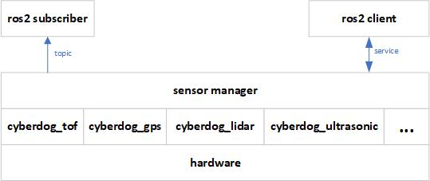
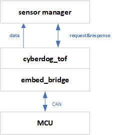
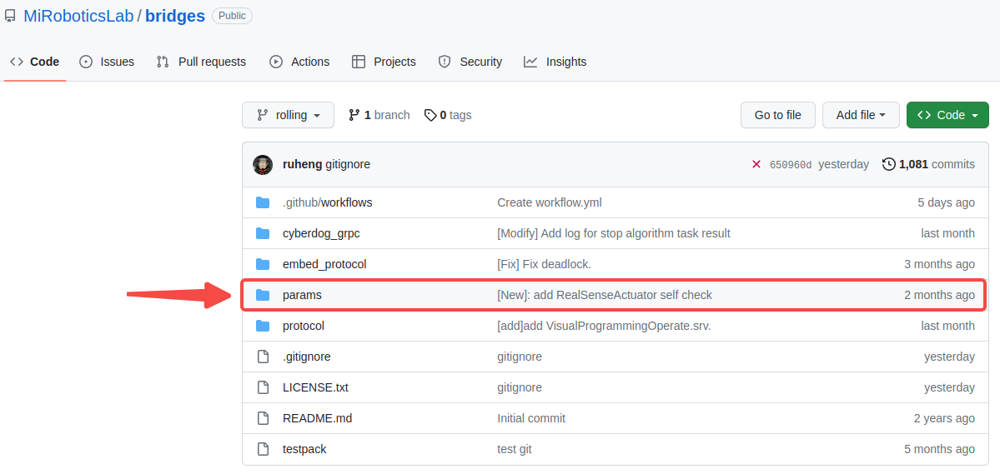
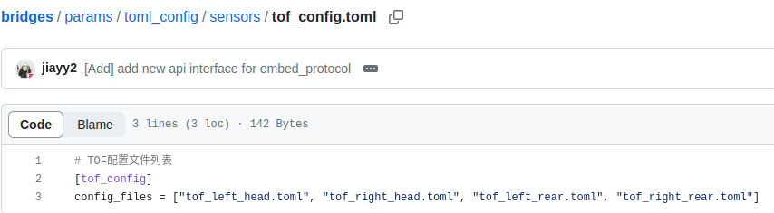
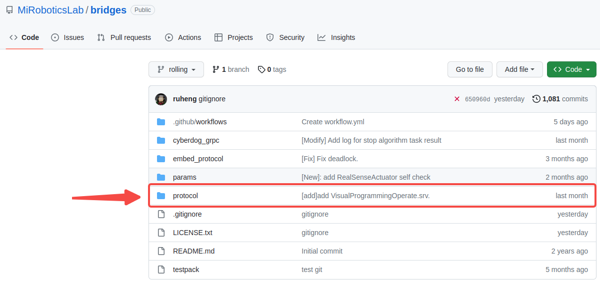
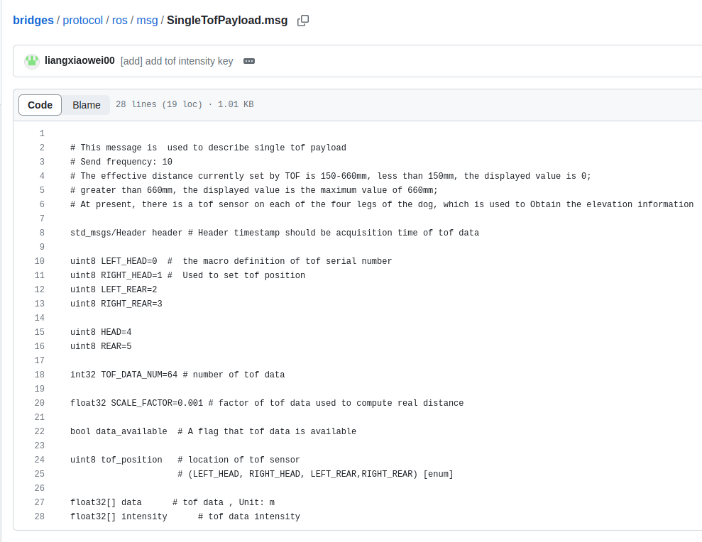

GitHub地址：https://github.com/jiayy2/CyberDogDemos

#  课程大纲

知识讲解

demo演示

#  内容详情

- **功能介绍**：device_manager,sensor_manager是外设和传感器管理模块;主要负责管理如LIDAR、tof和超声波传感器的使能控制和数据采集,管理如touch等外设模块的启动,休眠等状态切换。

- **ROS Plugin:**

https://github.com/ros2/ros2_documentation/blob/galactic/source/Tutorials/Beginner-Client-Libraries/Pluginlib.rst

## 软件框架

### sensor_manager



### tof_plugin



##   配置文件介绍

### toml配置文件(以TOF为例)

源码仓库:https://github.com/MiRoboticsLab/bridges

toml文件路径:bridges/params/toml_config





- 源码路径：`bridges/params/toml_config/sensors`

- 安装路径：`/opt/ros2/cyberdog/share/params/toml_config/sensors`

- 配置文件：
  - `tof_config.toml`:用于配置传感器个数和实际的配置文件
  - `tof_left_head.toml`:用于配置头部左边传感器
  - `tof_right_head.toml`:用于配置头部右边传感器
  - `tof_left_rear.toml`:用于配置尾部左边传感器
  - `tof_right_rear.toml`:用于配置尾部右边传感器

```C++
# Testing normal usage STD_CAN with std_frame
protocol = "can"
name = "left_head_tof"

can_interface = "can1"
extended_frame = true
canfd_enable = false
timeout_us = 1234567

#left
[[array]]
description = ""
can_package_num = 17
can_id = ["0x018F4000", "0x018F4001", "0x018F4002", "0x018F4003", "0x018F4004", "0x018F4005", "0x018F4006", "0x018F4007", "0x018F4008", "0x018F4009", "0x018F400A", "0x018F400B", "0x018F400C", "0x018F400D", "0x018F400E", "0x018F400F", "0x018F4010"]
array_name = "data"

[[array]]
description = ""
can_package_num = 1
can_id = ["0x018F2200"]
array_name = "enable_on_ack"

[[array]]
description = ""
can_package_num = 1
can_id = ["0x018F2400"]
array_name = "enable_off_ack"

[[cmd]]
description = ""
cmd_name = "enable_on"
can_id = "0x018E2200"
ctrl_len = 1
ctrl_data = ["0x00"]

[[cmd]]
description = ""
cmd_name = "enable_off"
can_id = "0x018E2400"
ctrl_len = 1
ctrl_data = ["0x00"]
```

- 主要配置说明：
  - `config_files`:程序根据数组成员实例出对应的传感器实体
  - `protocol`:通信协议，默认为CAN。
  - `can_interface`:CAN通信的消息通道，可配置`can0`、`can1`
  - `array`:数据包消息接收配置
    - `array_name`:数据包名称
    - `can_package_num`:数据包中，CAN数据帧的个数
    - `can_id`:数据包中，CAN数据帧的`CAN_id`
  - `cmd`:指令包消息发送配置
    - `cmd_name`:指令包名称
    - `can_id`:指令包中，CAN数据帧的`CAN_id`
    - `ctrl_len`:指令包中，CAN数据帧的数据长度
    - `ctrl_data`:指令包中，CAN数据帧的数据默认值

### can工具使用

一般candump和cansend工具配合使用.

#### candump工具

candump是一个用于读取CAN总线数据的工具，常用于调试和分析CAN总线数据。

以下是机器狗使用candump的基本步骤：

```
1. ssh登陆机器狗:ssh xiaomi@192.168.55.1 密码:123。
2. 打开终端，输入以下命令启动candump：
   
   candump can0

   其中can0是CAN接口的名称，目前机器狗有两路,can0和can1。
   具体数据使用的哪一路can可根据toml文件can_interface
3. 当CAN总线上有数据传输时，candump会将数据打印到终端上，例如：
   ```
   can0  123   [1]  11
   can0  456   [8]  12 34 56 78 9A BC DE F0
   ```
   其中can0表示数据来自CAN接口的名称，123和456表示CAN帧的标识符，[1]和[8]表示数据长度，11、12、34等表示具体的数据内容。
4. 按Ctrl+C键可以停止candump的运行。
```

#### cansend工具

cansend是一个用于向CAN总线发送数据的工具，常用于测试和调试CAN总线。

```
以下是使用cansend的基本步骤：
1. ssh登陆机器狗:ssh xiaomi@192.168.55.1 密码:123。
2. 打开终端，输入以下命令发送CAN数据：
   
   cansend can0 123#11223344

   其中can0是CAN接口的名称，123是CAN帧的标识符，#后面的内容是数据内容。11223344表示4个    字节的数据，可以根据需要进行修改。
3. 如果需要发送更多的数据，可以使用以下命令：

   cansend can0 123#11223344 456#AABBCCDD

   其中456是另一个CAN帧的标识符，#后面的内容是数据内容。
4. 按Ctrl+C键可以停止cansend的运行。
```

##  Protocol协议介绍(以TOF为例)





- 源码路径：`bridges/protocol/ros`

- 主要msg说明：
  - `protocol/ros/msg/SingleTofPayload.msg`:单个TOF,ros2 msg协议格式
  - `protocol/ros/msg/HeadTofPayload.msg`:头部TOF,ros2 msg协议格式
  - `protocol/ros/msg/RearTofPayload.msg`:尾部TOF,ros2 msg协议格式

```JSON
# HeadTofPayload.msg
# This message is  used to describe head tofs

SingleTofPayload left_head
SingleTofPayload right_head
# RearTofPayload.msg
# This message is  used to describe rear tofs

SingleTofPayload left_rear
SingleTofPayload right_rear
```

## Tof API接口

- `Init(bool simulator)`：初始化配置
  - `simulator = true`:配置为仿真模式

- `Open()`：打开传感器

- `Start()`：使能传感器

- `Stop()`：停止传感器

- `Close()`：关闭传感器

- `SelfCheck()`：传感器自检

- `LowPowerOn()`：进入低功耗模式

- `LowPowerOff()`：退出低功耗模式

- `SetSinglePayloadCallback(std::function<void(std::shared_ptr<protocol::msg::SingleTofPayload> payload)> cb)`：设置消息回调函数

# Demo演示

## demo讲解

### 代码框架

```Go
CyberDogDemos
├── README.md
└── tof_plugin_demo
    ├── CMakeLists.txt
    ├── include
    │   ├── tof_pub.hpp
    │   └── tof_sub.hpp
    ├── package.xml
    ├── README.md
    └── src
        ├── tof_pub.cpp
        └── tof_sub.cpp
int main(int argc, char * argv[])
{
  rclcpp::init(argc, argv);
  rclcpp::executors::MultiThreadedExecutor executor_;
  auto node = std::make_shared<TofSub>();
  executor_.add_node(node);
  executor_.spin();
  rclcpp::shutdown();
  return 0;
}
```

### TOF plugin使用(数据发布)

```C++
class TofPub : public rclcpp::Node
{
public:
  TofPub()
  : Node("TofPub")
  {
    name_ = "TofPub";
    count_ = 0;
    class_loader_ = std::make_shared<pluginlib::ClassLoader<cyberdog::sensor::TofBase>>("cyberdog_tof", "cyberdog::sensor::TofBase");
    tof_pub_ = this->create_publisher<protocol::msg::SingleTofPayload>(
    "tof", rclcpp::SystemDefaultsQoS());

    tof_ = class_loader_->createSharedInstance("cyberdog::sensor::TofCarpo");

    tof_->SetSinglePayloadCallback(
    std::bind(
      &TofPub::SingleTofPayloadCallback, this,
      std::placeholders::_1));
    // init
    tof_->Init(false);
    // start tof
    tof_->Start();
  }

private:

  void SingleTofPayloadCallback(std::shared_ptr<protocol::msg::SingleTofPayload> msg)
  {
    count_++;
    if((count_ % 40) == 0)
    {
      RCLCPP_INFO(this->get_logger(), "get msg frame:[%s]",msg->header.frame_id.c_str());
    }
    // 消息发布
    tof_pub_->publish(*msg);
  }

  rclcpp::CallbackGroup::SharedPtr group_;
  std::shared_ptr<pluginlib::ClassLoader<cyberdog::sensor::TofBase>> class_loader_;
  
  std::shared_ptr<cyberdog::sensor::TofBase> tof_;
  rclcpp::Publisher<protocol::msg::SingleTofPayload>::SharedPtr tof_pub_;
  std::string name_;
  int count_;
};
```

### TOF 数据订阅

```C++
class TofSub : public rclcpp::Node
{
public:
  TofSub()
  : Node("TofSub")
  {
    name_ = "TofSub";
    count_ = 0;
    count1_ = 0;
    count2_ = 0;
    // subcribe self tof
    tof_ = 
    this->create_subscription<protocol::msg::SingleTofPayload>(
      "tof", 5,
      std::bind(&TofSub::TofCallback, this,std::placeholders::_1));

    // subcribe head_tof_payload
    head_tof_ = 
    this->create_subscription<protocol::msg::HeadTofPayload>(
      "head_tof_payload", 5,
      std::bind(&TofSub::HeadTofCallback, this,std::placeholders::_1));

    // subcribe rear_tof_payload
    rear_tof_ = 
    this->create_subscription<protocol::msg::RearTofPayload>(
      "rear_tof_payload", 5,
      std::bind(&TofSub::RearTofCallback, this,std::placeholders::_1));
  }

private:
  int CheckShutDown(int count)
  {
    if(count >= 10) {
      RCLCPP_INFO(this->get_logger(), "shutdown scribe");
      // shutdown;
      rclcpp::shutdown();
    }
  }

  void TofCallback(const protocol::msg::SingleTofPayload::SharedPtr msg)
  {
    RCLCPP_INFO(this->get_logger(), "get tof msg");
    count_++;
    CheckShutDown(count_);
  }

  void HeadTofCallback(const protocol::msg::HeadTofPayload::SharedPtr msg)
  {
    RCLCPP_INFO(this->get_logger(), "get head tof msg");
    count1_++;
    CheckShutDown(count1_);
  }

  void RearTofCallback(const protocol::msg::RearTofPayload::SharedPtr msg)
  {
    RCLCPP_INFO(this->get_logger(), "get rear tof msg");
    count2_++;
    CheckShutDown(count2_);
  }

  rclcpp::CallbackGroup::SharedPtr group_;
  rclcpp::TimerBase::SharedPtr timer_;
  rclcpp::Subscription<protocol::msg::SingleTofPayload>::SharedPtr tof_ {nullptr};
  rclcpp::Subscription<protocol::msg::HeadTofPayload>::SharedPtr head_tof_ {nullptr};
  rclcpp::Subscription<protocol::msg::RearTofPayload>::SharedPtr rear_tof_ {nullptr};
  std::string name_;
  int count_;
  int count1_;
  int count2_;
};
```

## 编译运行

### 编译

**参考****Dockerfile使用说明**

https://miroboticslab.github.io/blogs/#/cn/dockerfile_instructions_cn

```Python
# 打开docker 容器
 cd /home/builder/cyberdog_ws
 git clone https://github.com/jiayy2/CyberDogDemos
 colcon build --merge-install --packages-up-to tof_plugin_demo
```

### 运行


#### **tof_pub**

```Python
// 发布tof
ros2 run tof_plugin_demo tof_pub --ros-args -r __ns:=/`ros2 node list | grep "mi_" | head -n 1 | cut -f 2 -d "/"`
// 或者
ros2 run tof_plugin_demo tof_pub
```

#### **tof_sub**

```Bash
//监听tof
ros2 run tof_plugin_demo tof_sub --ros-args -r __ns:=/`ros2 node list | grep "mi_" | head -n 1 | cut -f 2 -d "/"`
// 或者
ros2 run tof_plugin_demo tof_sub
```

#### 为了避免干扰测试，可以在机器狗启动后执行以下命令

```Bash
sudo systemctl stop cyberdog_bringup.service
```